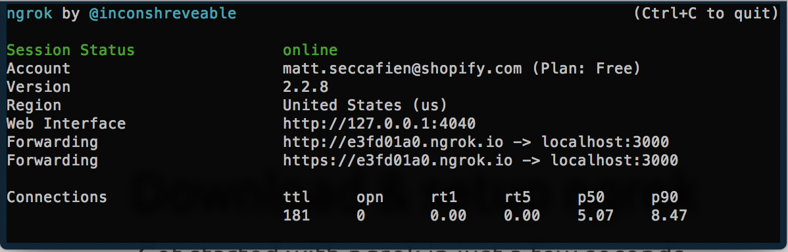
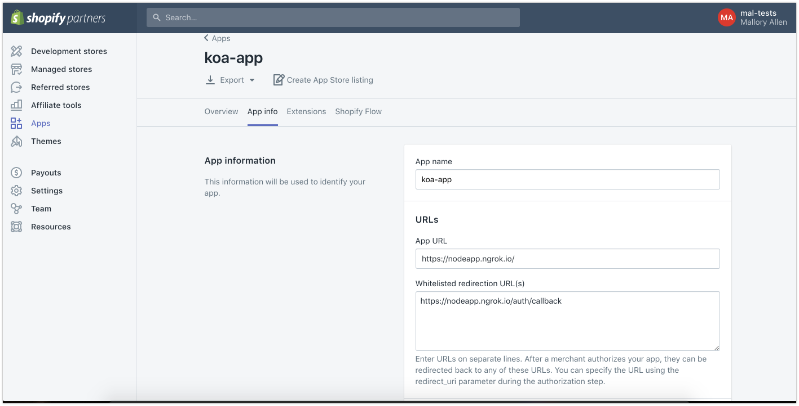

# Unite 2018 - React/Node App Workshop

In this repo you'll find everything you need to follow along with the workshop.

## Before starting

The following steps should be done before you start the workshop

### Install Node (and npm)

Install the latest LTS version of node from [the official site](https://nodejs.org/en/download/). This will include the npm client we'll use to install dependencies.

### Install git

We'll be using git heavily in this workshop, and you'll especially need it if you fall behind.

### Expose your dev environment to the internet

You will need to download ngrok at https://ngrok.com/download and signup for a free account. Move the unziped ngrok client to your user folder and run the following in your terminal.

```bash
$ ./ngrok http 3000
```

This should display a UI in your terminal with the public URL of your tunnel and other status and metrics information about connections made over your tunnel. It should something like this:



### Set up an App on the partners dashboard

Log into the [partner dashboard](https://partners.shopify.com/organizations) and click "Apps" from the main dashboard navigation. Then click "Create app".

Give you app a name, this can be anything you'd like.

Set the app URL to the public URL of you ngrok tunnel. This should be displayed in the UI under "Fowarding" and should end with `.ngrok.io` for example `https://e3fd01a0.ngrok.io`.

In the workshop we'll be using `/auth/callback` as our oauth callback route, so add that to your whitelist.



For example, for the address above you would add `https://e3fd01a0.ngrok.io/auth/callback`.

Rename `.env.example` to `.env` and copy and paste your Shopify Api Key and Secret to this file. These can be found in under App credentials, near the bottom of the App Info page.

```
SHOPIFY_API_KEY=YOUR_SHOPIFY_API_KEY
SHOPIFY_SECRET=YOUR_SHOPIFY_SECRET
```

## Starting the app

Install the dependencies by running in the project root:
`npm install`

And finally run the app:
`npm start`

Open a browser and go to either [localhost:3000](localhost:3000) or the url provided by ngrok.

If successful, you should see a hello message in your browser.

If you ran into any issues with the above steps, please reach our to matt.seccafien@shopify.com before the workshop.

Rename `.env.example` to `.env` and copy and paste your Shopify Api Key and Secret to this file.

```
SHOPIFY_API_KEY=YOUR_SHOPIFY_API_KEY
SHOPIFY_SECRET=YOUR_SHOPIFY_SECRET
```

## Using this repo

The starting stage of each step of the workshop is represented by a branch in this repo. If you fall behind or accidently get into a broken state, you can always checkout the appropriate branch.

For example, if you are still on step1 and the workshop has moved on to step2, you can run:

```
git stash
git checkout step2
```

## Whats included

We have pre-configured a number of tools to get started quickly. You do not need to have a deep understanding of them for this workshop, however feel free to learn more about them in the following links.

* [babel](https://babeljs.io/) lets us use modern syntax and JSX everywhere
* [webpack](https://webpack.js.org/) compiles our client-side code into a bundle
* [prettier](https://prettier.io/) make our code look pretty and maintains consistency
* [dotenv](https://github.com/motdotla/dotenv) helps configure our environment variables
* [koa](https://koajs.com/) minimalistic and modern node server framework
