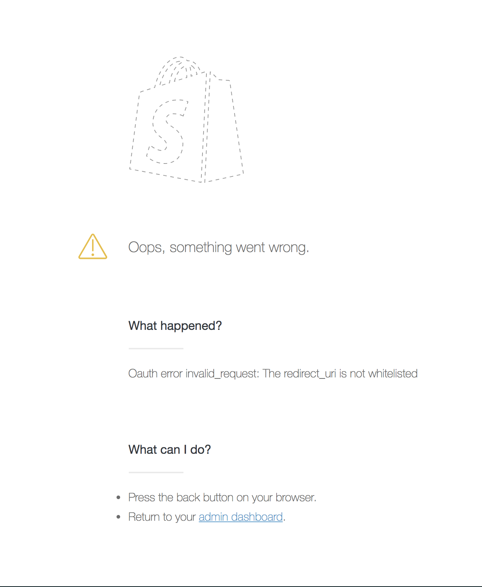

# Building a Shopify App

_with React and Koa_

### Workshop overview

Together we will be building a Shopify app that creates products from a list of hot board games. To do so we'll need to write a Koa server which knows how retrieve an access token from Shopify, build a React front-end that knows how to fetch boardgames and create products from those boardgames using Shopify's admin GraphQL API.

### Goals

* Give attendees a running start building a modern web-app using Shopify’s tools for the Node and React ecosystems.
* Raise awareness with attendees about what libraries we have available for building apps.
* Level up attendees skills with modern Javascript libraries.

#### Structure

* Introduction
* Babel and ES6
* Set up and intro to Koa (Mal)
* Let’s build an app!
  * Step 1: Authing with Shopify (Mal)
  * Step 2: Serving HTML with React (Matt)
  * Step 3: React in the Browser (Matt)
  * Step 4: Fetching some games (Mal)
  * Step 5: Creating Products with GraphQL (Matt)
* What's next
* Additional Resources
* Q & A

### Set up and intro to Koa (Mal)

If you have not done so already, follow the steps in the [README](./README.md).

In the root of this project, there are a number of configurations files and a few Javascript files to get us started.

Open up `index.js`, this is the entry point of our application which imports `index.js` and mounts it on port 3000.

If you open the `server/index.js` you will see of our "Hello Unite!" logic. We've also set a few things up so that we can use our `SHOPIFY_SECRET` and `SHOPIFY_API_KEY` using a library called `dotenv`, but more on that later.

Koa is a minimalistic node framework for modern Javascript apps that we will be using for our server in this workshop. It is built around the ES2016 `async` and `await` keywords.

In Koa you express your application logic as a series of asynchronous functions called middleware, which is just a fancy word for functions that all operate on a `context` or `ctx` object, and await on a `next` function to yield flow back into the rest of the app. Before we actually start building out our app, let's just write some code to better explain this concept.

We are going to add another middleware function. This going to be an `aysnc` function with a second `next` paramater. This is a function that resolves to a promise that we can `await` on, telling Koa to pause this current middleware and move on to the next one in the chain.

```js
app.use(async function(ctx, next) {
  console.log('Middleware 1');
  await next();
});
```

_an example koa middleware_

If you refresh the browser where you are running the app it should still look the same, but you should see `Middleware 1` printed in the console. Let's add another middleware, but this time after our initial middleware. So our entire middleware chain looks like this.

```js
app.use(async function(ctx, next) {
  // log 'Middleware 1'
  console.log('Middleware 1');
  // then pause and wait for the next middleware
  await next();
});

app.use(function(ctx) {
  // then log 'Middleware 2'
  console.log(`Middleware 2`);
  // and set the body of our response to 'Hello Unite'
  ctx.body = 'Hello Unite :)';
});

app.use(async function(ctx, next) {
  // the app will never get here
  console.log('Middleware 3');
  await next();
});
```

_example koa middlewares with a terminating middleware_

If you refresh the browser, you should see `Middleware 1` and `Middleware 2` printed in the console, but not `Middleware 3`. That’s because Koa ends the request once the middleware Promise chain is resolved. That means the response was sent to the client before we got to our third middleware. We can solve this by changing our index function into an `async` function that has `await next()` like our other middleware does.

We said Koa "pauses" the excecution of the function, so let's log some messages after our `next()` calls to get a better idea of what is meant by this.

```js
app.use(async function(ctx, next) {
  // log 'middleware 1'
  console.log('middleware 1');
  // then pause and wait for the next middleware
  await next();
  // then log 'back to middleware 1'
  console.log('back to middleware 1');
});

app.use(async function(ctx, next) {
  // log 'middleware 2'
  console.log(`middleware 2`);
  // then set the body to 'Hello Unite :)'
  ctx.body = 'Hello Unite :)';
  // then pause and wait for the next middleware
  await next();
  // then log 'back to middleware 2'
  console.log('back to middleware 2');
});

app.use(async function(ctx, next) {
  // first log middleware 3
  console.log('middleware 3');
  // then wait for any further downstream middleware
  await next();
  // then log back to middleware 3;
  console.log('back to middleware 3');
});
```

_example koa middleware with logic after next()_

This time in the console, we see this:

```bash
Middleware 1
Middleware 2
Middleware 3
Back to Middleware 3
Back to Middleware 2
Back to Middleware 1
```

_example console log_

As you can see, Koa made its way up the middleware chain pausing each function when we `await` on `next()` before passing the flow to the next middleware in the chain. It does this until there are no more middleware left and then it resumes each middleware in the reverse order they were added.

Hopefully that gave you a good primer on Koa, we will be using installing and using some Koa middleware packages from npm as well as writing our own middlelware through out this workshop.

### Let’s build an app!

#### Step 1: Authing with Shopify (Mal)

The first middleware we are going to install will be used to get our app to show up in our Shopify store. We'll use the koa auth package that Shopify provides. Install it by running:

```bash
npm add koa-session @shopify/koa-shopify-auth
```

In `server/index.js` add the following lines to import it into our app.

```js
import session from 'koa-session';
import createShopifyAuth from '@shopify/koa-shopify-auth';
```

_server/index.js_

We can mount our middlware by adding the following lines after we intialize our new Koa app.

```js
app.use(session(app));
```

_server/index.js_

We are mounting the session middleware and passing our Koa app instance into it.

Next we need to use the Shopify Auth Middleware. To configure it we'll need to pass the apiKey, our secret.

We can grab both our `SHOPIFY_SECRET` and `SHOPIFY_API_KEY` from the environment.

```js
const {SHOPIFY_API_KEY, SHOPIFY_SECRET} = process.env;
```

_server/index.js_

Then we'll add the middleware to the app and pass in some configuration.

```js
app.use(
  createShopifyAuth({
    // your shopify app's api key
    apiKey: SHOPIFY_API_KEY,
    // your shopify app's api secret
    secret: SHOPIFY_SECRET,
    // our app's permissions
    // we need to write products to the user's store
    scopes: ['write_products'],
    // our own custom logic after authentication has completed
    afterAuth(ctx) {
      const {shop, accessToken} = ctx.session;

      console.log('We did it!', shop, accessToken);

      ctx.redirect('/');
    },
  }),
);
```

_server/index.js_

`afterAuth` here tells our app what to do when an authentication successfully completes. We will just print a message and redirect to the root or our app.

With this done, we'll add `app.keys` to let us use session securely. Set this to your Shopify secret before we mount our session middleware.

```js
app.keys = [SHOPIFY_SECRET];
```

_server/index.js_

To try out our authenticate flow, lets visit `YOUR_HTTPS_NGROK_URL/auth?shop=YOUR_SHOP_DOMAIN`.

You might see an error screen that states:

```
Oauth error invalid_request: The redirect_uri is not whitelisted
```



To solve this we need to login to our partners dashboard, go to our App Info and add `YOUR_HTTPS_NGROK_URL/auth/callback` to "Whitelisted redirection URL(s)" textarea.

Now if you try to authenicate again, (`YOUR_HTTPS_NGROK_URL/auth?shop=YOUR_SHOP_DOMAIN`) it should take you to install the app in the Shopify admin. Once its installed you can verify it shows by going to to `YOUR_SHOPIFY_URL/admin/apps`.

We now have an authentication route, but users can still go straight to our index without logging in. You can verifiy this by clearing your cookies or loading the your ngrok url in an icognito tab. The next step will protect our `Hello Unite` with a verification middleware.

The `@shopify/koa-shopify-auth` package exports a middleware for this exact purpose.

```js
import createShopifyAuth, {
  createVerifyRequest,
} from '@shopify/koa-shopify-auth';
```

_server/index.js_

Now we can add the following between our Auth and Hello Unite middlewares.

```js
// secure all middleware after this line
app.use(createVerifyRequest());
```

_server/index.js_

Everything below this middleware will require authentication, everything above will not.

Congratulations! You have just built a app that will render in the Shopify admin and knows how to authenicate with Shopify. Now lets actually work on making our app do something.

#### Step 2: Serving HTML with React

Up to this point, our server has just been rendering a simple string, but we actually want to serve up an HTML page. In the past, this might have done with templating or string interpolation, but we will use React on the server to generate our app markup. This will let us reuse our code on the server and client and have one source of truth for the resulting UI.

As the quickest of primers, React is a component based library for declaratively building user interfaces. Components are expressed as either functions of their input (props) or as subclasses of `React.Component`. For our purposes today we will be using entirely stateless functional components.

```js
function Button(props) {
  /*
    this html-esque syntax is called JSX
    JSX is a simple sugar on top of calls to React.createElement
    this line translates to:
    React.createElement(
      'button',
      {
        onClick: props.onClick,
        style: myCoolButtonStyles,
      },
      props.children
    )
    babel lets us use this syntax freely ✨
  */
  return (
    <button
      /*
        curly braces inside JSX allow for interpolation
        very similar to handlebars
       */
      style={myCoolButtonStyles}
      /*
        React knows how to handle binding and unbinding
        listeners for you, so you can simply use this props
        syntax instead.
      */
      onClick={props.onClick}
    >
      {props.children}
    </button>;
}

/*
  we need to use React's render methods to
  transform our components into HTML
*/
ReactDOM.renderToString(<Button></Button>) // => html string
```

_an example react component_

So how are we going to actually use this in our server? Well, with a middleware ofcourse. This middleware will generate markup run our react code, lets install a few things to helps to do this.

```bash
npm add react react-dom @shopify/react-html
```

Since this middleware will be a bit meatier than the others, lets devote a new file to it. Create a new file in the server directory called `render-react-app.js` and add the following code.

```js
import React from 'react';
import {renderToString} from 'react-dom/server';
import HTML from '@shopify/react-html';

export default (ctx) => {
  const markup = renderToString(
    <HTML>
      <div>Hello React</div>
    </HTML>,
  );

  ctx.body = markup;
};
```

_server/render-react-app.js_

Now we need to tell our Koa app to use this middleware, so back in `server/index.js` import the file. We are going to replace the last middleware in our chain with our custom one.

```diff
// after other imports
+ import renderReactApp from './render-react-app';

// after other middleware
- app.use(function index(ctx) {
-   ctx.body = 'Hello Unite :)';
- });
+ app.use(renderReactApp);
```

You should now see "Hello React", which is great but we actually want to render our app, not just a string. To do this we need to start thinking in components.

We are going to create our main App component and render that on the server. Create a new file inside of `/app` called `App.js`, this is where we will define our first component, a simple component that renders a title for our page.

```js
import React from 'react';

export default function() {
  return (
    <div>
      <h1>Board game loader</h1>
    </div>
  );
}
```

_app/App.js_

Now we can use this component in our middleware within `server/render-react-app.js`

```diff
import React from 'react';
import {renderToString} from 'react-dom/server';
import HTML from '@shopify/react-html';

+ import App from '../app/App';

export default (ctx) => {
  const markup = renderToString(
    <HTML>
-      <div>{title}</div>
+      <App />
    </HTML>
  );

  ctx.body = markup;
}
```

_server/render-react-app.js_

If you view source or use the inspect panel on your browser on your page now you should see a full HTML document with an `app` div and our App component's `<h1 />`.

This App component will come to represent the our entire tree of components, which can be as deep as it needs to be without ever changing this tag.

For demonstration purposes, next we'll add a hover handler onto our title, that logs out a message to the console.

```js
import React from 'react';

export default function() {
  return (
    <div onHover={() => console.log('Hi!')}>
      <h1>Board game loader</h1>
    </div>
  );
}
```

_app/App.js_

Unfortunately, this code won't actually work yet.

This is due to the fact that we are missing one crucial piece of a modern web app; client side Javascript. We will need to be able run our React code in the browser to rectify this.

#### Step 3: React in the Browser

Much like we have a server folder for server code, lets create a client folder for client code. We should strive to end up with very little code in this folder as the bulk of our logic should be universal between both the server and client, living in the `/app` folder.

Next we are going to mount our same React application in the browser, this is called "hydrating" the DOM.

```js
import React from 'react';
import ReactDOM from 'react-dom';

import App from '../app/App';

console.log('hello from the client');

ReactDOM.hydrate(<App />, document.getElementById('app'));
```

_client/index.js_

In our code we are querying for an element with the id `app` and using that element to as the place to mount our client-side react app.

But where does this element with the `app` id come from? Well, the HTML component we imported from `@shopify/react-html` automatically wraps our contents in a div with an id of `app`. Conviently it will also add our client-side script to the markup, if we tell it to.

Our client-side script will need to include React, ReactDOM, our app component and anything else we add in the future.

We’ll use webpack 4 for this. Webpack is an open-source Javascript module bundler. It consumes your client side code, traverses it’s dependencies, and generates static assets representing those modules.

Again, first step is to install the packages we need, `webpack` and the `koa-webpack` middleware.

```bash
npm add webpack koa-webpack
```

Import the `koa-webpack` middleware and add it to the bottom of our middleware chain:

```js
app.use(webpack());
```

_server/index.js_

This middleware will look for a `webpack.config.js` in the project root and that will tell webpack how to compile our code. For our app, we want to run our `js` files through the `babel-loader`, but we've pre-configured webpack for you in this repo.

Now that this middleware is installed you should see a 'Compiled Successfully' message in your console. The final step is to tell our `<HTML />` component to include the compiled script bundle.

This is done with a prop to our the `<HTML />` component called `deferedScripts` we can add that now.

```js
<HTML
  deferedScripts={[{path: 'bundle.js'}]}
>
```

_server/render-react-app.js_

Now if you refresh the browser, you should see a log in our console "Hello from the client", this is coming from client-side Javascript.

#### Step 4: Fetching some games (Mal)

Now we are finally ready to get our app doing all the things we said it would. Let's fetch some board games so that we can show the user to choose from.

The repo has come with a few small, pre-built components inside of the `/app` folder. One of these is a `<GameList />` component that will be responsible for rendering a list of games.

Lets import that component into our App.

```js
import GameList from './components/GameList';
```

_app/App.js_

Our games are going to be coming from [https://boardgameslist.herokuapp.com](https://boardgameslist.herokuapp.com) and we need to write some logic to fetch them. We will also want logic to handle errors and loading while we wait for a response. This would be quite verbose to do manually so let's add a component will help use do this in a clean and easy way.

```bash
npm add react-fetch-component
```

Import the `<Fetch />` component from this package inside of our `app/App.js`

```js
import Fetch from 'react-fetch-component';
```

_app/App.js_

This component uses a `renderProp`, a pattern whereby we pass a function as the `children` prop to a component. That function will be called with the derived state needed to render without having to worry where the state comes from.

In the case of the `<Fetch />` component we will trust it to handle the details getting the games from the API and passing in everything we need to render.

Lets start by just rendering the component with the URL to our API, and using the `as` prop to tell it to parse the response as `json`.

```js
<Fetch url="https://boardgameslist.herokuapp.com" as="json" />
```

_app/App.js_

`<Fetch />` will pass the state of our request as a single object with a boolean `loading` property that we can use to check if the request is in process, an `error` property that is undefined unless there is an error in our request and finally the resulting `data` from our request.

We'll add logic to handle each of these properties and render content based on the state of the request.

```js
<Fetch url="https://boardgameslist.herokuapp.com" as="json">
  {(fetchResults) => {
    if (fetchResults.loading) {
      return <p>Loading</p>
    }

    if (fetchResults.error) {
      return <p>failed to fetch games</p>
    }

    return <GameList games={fetchResults.data} />
  }}

</Fetch>
```

_app/App.js_

If we refresh our page we should now see a list of games.

#### Step 5: Creating Products with GraphQL (Matt)

So we now have a list of games, so now we can create products from them. To do this we are going to use Shopify's Admin GraphQL API.

Using a GraphQL API allows us to "query" data and make changes to it with "mutations". We won't have time to go too deep into how this works in this workshop, but we will perform a simple mutation.

The first thing we need to do to work with a GraphQL API is install a GraphQL client. We will use a library called Apollo for this. Similar to the `<Fetch />`, Apollo's compone will handle the complexity of working with the API, such as low-level networking details and maintaining a local cache.

Let's install the Apollo dependencies, `react-apollo` and `apollo-boost`.

```bash
npm add apollo-boost react-apollo@beta
```

We also have a Shopify middleware that we are going to add in order to securely proxy graphql requests from our app to Shopify.

```bash
npm add @shopify/koa-shopify-graphql-proxy
```

Lets begin by importing and adding the `koa-shopify-graphql-proxy` to our middleware chain, just before server rendered react app middleware.

```js
import graphQLProxy from '@shopify/koa-shopify-graphql-proxy';

//... later on
app.use(graphQLProxy);
```

_server/index.js_

Now on the client side, lets configure our Apollo client. We are going to this at the top-level of our application in `app/App.js`.

```js
import ApolloClient from 'apollo-boost';
import {ApolloProvider} from 'react-apollo';

const client = new ApolloClient({
  fetchOptions: {
    credentials: 'include',
  },
});
```

_app/App.js_

This is very basic configuration for Apollo, we just need to include our cookies so that the server can match the session to our browser session. By default it will make requests to '/graphql'. We now need to wrap our `<App />` in the `<ApolloProvider />`, passing it the `client` we just created. This gives components further down in our tree access to the Apollo Client.

```diff
export default function() {
  return (
+   <ApolloProvider client={client}>
      <h1>Board game list</h1>
      <Fetch url="https://boardgameslist.herokuapp.com" as="json">
        {({loading, error, data}) => {
          if (loading) {
            return <p>loading</p>;
          }
          if (error) {
            return <p>failed to fetch games</p>;
          }

          return <GameList games={data} />;
        }}
      </Fetch>
+   </ApolloProvider>
  );
}
```

_app/App.js_

Now with our Apollo client configured, we can use Apollo's `<Mutation />` component anywhere inside this provider.

The next step is to write the GraphQL mutation. `apollo-boost` exports a template literal tag that parses GraphQL queries called `gql`.

Let's create a constant and that is equal to the `gql` wrapped mutation we want to perform.

```js
const CREATE_PRODUCT = gql`
  mutation CreateProduct($product: ProductInput!) {
    productCreate(input: $product) {
      product {
        id
        title
      }
    }
  }
`;
```

_app/App.js_

We now use this query in a `<Mutation />` component. Let's import that component.

```js
import {Mutation} from 'react-apollo';
```

_app/App.js_

This component receives our mutation, in the `mutation` prop, and handles all the details of performing this mutation and holding the state of the result.

How this component renders is expressed using the same renderProp pattern we saw in our `Fetch` component in that it is also passed an object with similar `loading`, `error` and `data` properties. However, the first argument of the children function is a function that triggers the mutation when called, we will call this `createProduct`.

The ends up making the children of our `Mutation` function look pretty similar to that of our `Fetch` component.

```js
<Mutation mutation={CREATE_PRODUCT}>
  {(createProduct, mutationResults) => {
    return <GameList games={fetchResults.data} />;
  }}
</Mutation>
```

_app/App.js_

We want to call our mutation when a game's `Create Product` button is clicked. We can do this by passing a function into the `onAddGame` prop of our `<GameList />` component. Our `<GameList />`'s `onAddGame` callback is passed the name of the clicked game.

We can pass this along to our `createProduct` mutation function as the `title`, along with a `productType` of "borad game".

```js
<Mutation mutation={CREATE_PRODUCT}>
  {(createProduct, mutationResults) => {
    return (
      <GameList
        games={fetchResults.data}
        onAddGame={(title) => {
          const productInput = {
            title: title,
            productType: 'board game',
          };

          createProduct({
            variables: {product: productInput},
          });
        }}
      />
    );
  }}
</Mutation>
```

_app/App.js_

We can also use the `loading`, `data` and `error` properties from our `mutationResults` to show some user feedback.

The final code for the `<Mutation />` component should look like this:

```js
<Mutation mutation={CREATE_PRODUCT}>
  {(createProduct, mutationResults) => {
    const loading = mutationResults.loading && <p>loading... </p>;

    const error = mutationResults.error && <p>error creating product</p>;

    const success = mutationResults.data && (
      <p>
        successfully created &nbsp;
        {mutationResults.data.productCreate.product.title}
      </p>
    );

    return (
      <React.Fragment>
        <GameList
          games={fetchResults.data}
          onAddGame={(title) => {
            const productInput = {
              title: title,
              productType: 'board game',
            };

            createProduct({
              variables: {product: productInput},
            });
          }}
        />
        {loading}
        {error}
        {success}
      </React.Fragment>
    );
  }}
</Mutation>
```

_app/App.js_

### Closing thoughts

We covered a lot of different topics in this workshop, but hopefully this has given you a headstart on building web-apps using Shopify’s tools for the Node and React.

### Additional Resources

Here are some additional resources and official documentation about the technologies and patterns we touched on.

#### Core Libraries
* [React](https://reactjs.org/docs/hello-world.html)
* [Babel](https://babeljs.io/)
* [Webpack](https://webpack.js.org/)
* [Koa](https://koajs.com/)
* [Apollo](https://www.apollographql.com/docs/react/essentials/get-started.html)

#### Concepts
* [Render-props](https://reactjs.org/docs/render-props.html)
* [Graphql](https://www.howtographql.com/)

#### Components
* [Koa Shopify auth](https://github.com/Shopify/quilt/tree/master/packages/koa-shopify-auth)
* [React HTML component](https://github.com/Shopify/quilt/tree/master/packages/react-html)
* [Shopify graphQL proxy](https://github.com/Shopify/quilt/tree/master/packages/koa-shopify-graphql-proxy)
* [Prettier](https://prettier.io/)
* [React fetch](https://www.npmjs.com/package/react-fetch)
